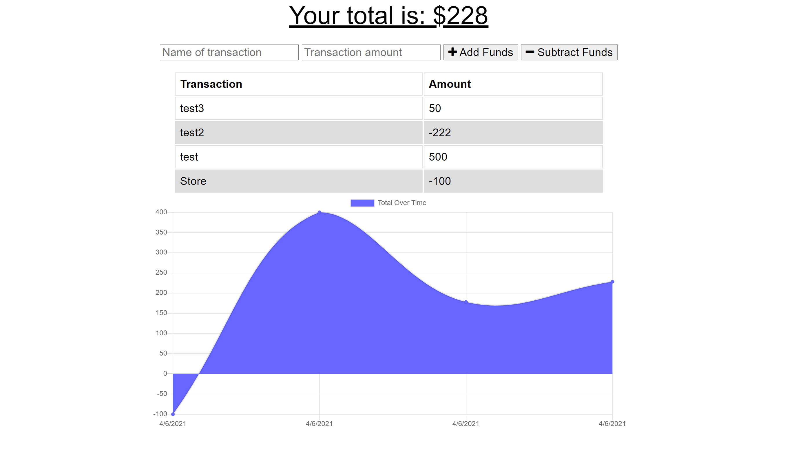

# Budget_Tracker
An online/offline budget tracker application that allows the user to add deposits and expenses. Uses indexedDb, service worker, webpack, mongo, mongoose, morgan, express, and compression.

## Installation:
run npm i

## Screenshots:

## Deployed:
live link deployed by Heroku at https://guarded-ravine-68129.herokuapp.com/ 

## Questions:
email: nwreese@kent.edu 